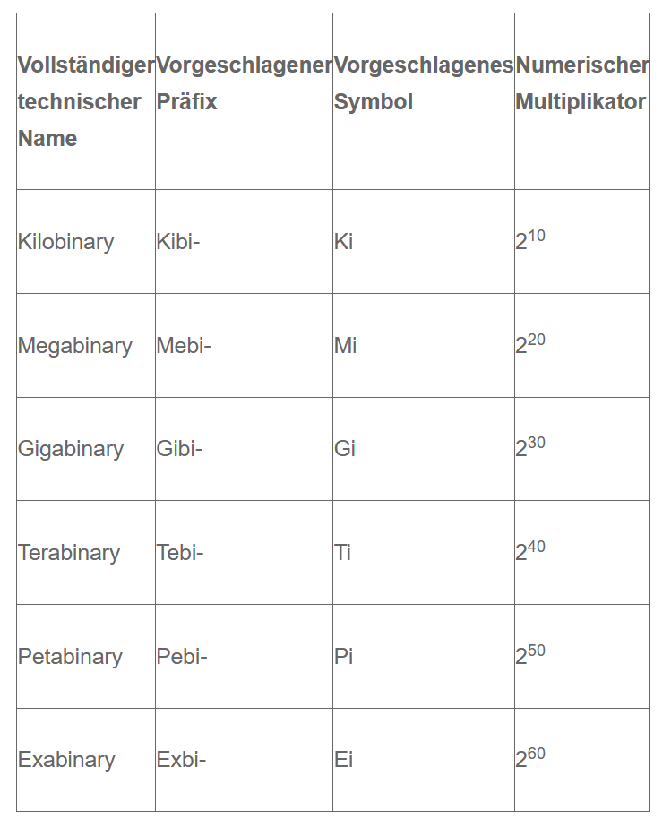

## switzerland.bin:
- 1291 gruendung schweiz
- 41285 flaeche Schweiz
- 4634 duforspitze
- 8090 zuerich postleitzahl

# Reflexion

Ich Konnte Heute vieles auffrischen, zum beispiel, dass double IEEE 754 verwenden, um sehr grosse zahlen zu representieren.
Ausserdem konnte ich bei den Aufgaben dinge, die ich über die Jahre vergessen habe, wieder auffrischen. Im Kahoot konnte ich auch vieles lernen kibi etc.
